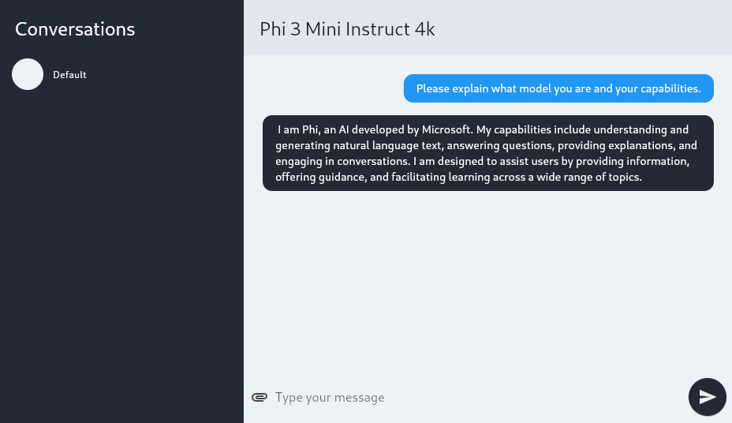

# Flutter Chat App with local ONNX GenAI

Example chat app using a local instance of the onnxruntime for local inferencing.

## Supported Architectures

|Linux|Windows|Android|iOS|Web|
|-|-|-|-|-|
| x64 |-|-|-|-|

## Getting Started

Ensure you have cloned https://github.com/adamped/onnx_genai into the same root directory as this project. Because onnx_genai isn't published to pub.dev.

Download the latest onnxruntime-geni libraries and place in the assets folder. Then correct the right version number in llm_service. https://github.com/microsoft/onnxruntime-genai/releases 

Currently this has only been tested with CPU optimized models: onnxruntime-genai-0.3.0-linux-x64.tar.gz

Download the ONNX model you want to use. Here is a list of a few you can use: https://huggingface.co/collections/EmbeddedLLM/onnx-genai-6671a24baf00e07508ef9062

Please note that when using Phi-3-mini, download all the files into a folder in assets. e.g. assets/phi-3-mini.

Depending on how you download these files they might have a prefix added to it, `Phi-3-mini-4k-instruct-062024-cpu-int4-rtn-block-32-acc-level-4-<filename>`. Remove this on all files so they are back to normal, e.g. `genai_config.json`

Enable build_runner watch to build the automatically generated files from Riverpod.

`dart run build_runner watch`
